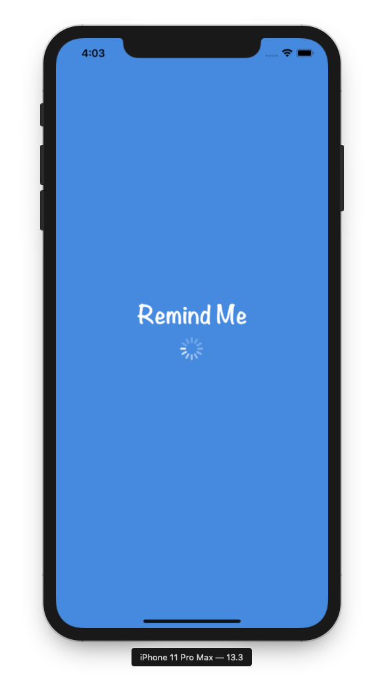
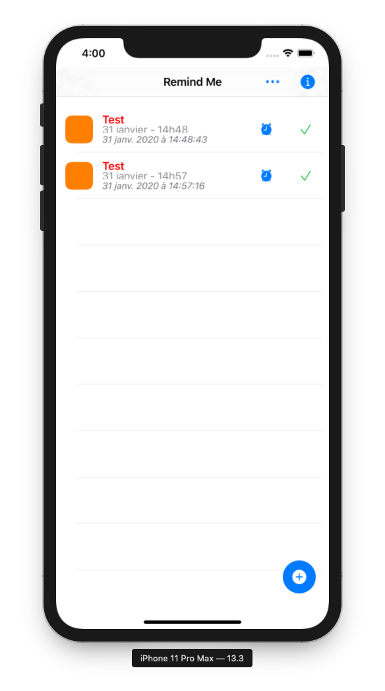
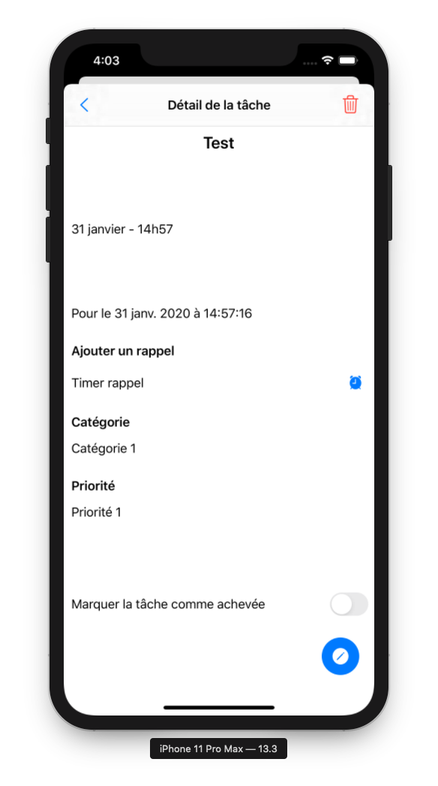

# Remind Me

## Infomations

This project has been developped by Nicolas TOURRETTE (4A IE - SQR).

## Objectives

This app is a schoolar project to introduce students to Swift programmation.

This app is a tasks manager. In it, you can add your task with some categories and priorities and display them by chronological order, the most urgent things to do are stored in the top of the list.

**Notice that you can update the tableview by scrolling from navbar to the bottom of the app.**

The title of tasks having a passed due date displays in red to warn you about the fact that these tasks are late.

You can touch a task to display its details.

## Lacks

This app has serveral lacks in the tasks gestion. You can't delete a task, mark a tash as achived and add more categories than coded in the app. There are these improvements to do. There is also no remind notification sent to your phone when a task is near to due date. It can be cool to add this feature with a beautiful notification appearing on the top of your iPhone or iPad (tested under these two Apple devices with the simulator).

Another improvement I really willing to do is to separate the task in different tableviews (to classify task by due date, e.g. today tasks, tomorrow tasks, next seven days tasks and tasks due in more than a week), but I spent a dozain of hours on it and I can't find any way to realize that.
